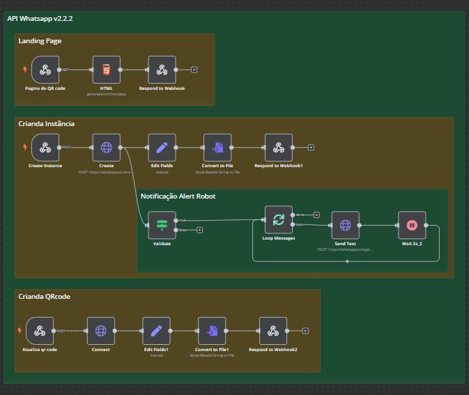

# 🔗 API Connection System

## 📌 Project Overview

This project facilitates seamless **WhatsApp API** integration, enabling automated instance creation, QR code generation, and communication handling. It is built using **n8n**, **WhatsApp API**, and **Webhook services** for efficient interaction.



## 🚀 Features

- 📲 **WhatsApp Integration**: Creates and manages WhatsApp API instances.
- 🔐 **QR Code Generation**: Generates QR codes for authentication.
- 🔄 **Instance Management**: Supports creating and updating API instances.
- 📡 **Webhook Handling**: Processes incoming and outgoing messages.
- 📢 **Alert Notifications**: Sends automated alerts on instance creation.

## 🛠 Technologies Used

- **n8n**: Workflow automation tool.
- **WhatsApp API**: Manages WhatsApp messaging services.
- **Webhook Services**: Handles real-time communication.
- **JavaScript/HTML**: Custom interface for QR code generation.

## 📁 File Descriptions

- **Conexao_API_s_v1_ON.json**: Contains workflows for API connection, QR code management, and instance updates.

## 🔧 How It Works

1. 📩 **Webhook Activation**: Listens for API requests.
2. 🏗 **Instance Creation**: Sets up a new WhatsApp API instance.
3. 🔄 **QR Code Generation**: Provides authentication for connection.
4. 🌐 **API Connectivity**: Establishes a connection with WhatsApp servers.
5. 📢 **Notifications**: Sends alerts when new instances are created.
6. 🔄 **Instance Updates**: Refreshes QR codes periodically.

## 📌 Installation & Setup

1. Clone the repository.
2. Install **n8n** and required dependencies.
3. Configure API keys for WhatsApp API and webhook services.
4. Import **Conexao_API_s_v1_ON.json** into **n8n**.
5. Start the n8n server and activate the workflows.

## 🛠 Configuration

- **.env** file should include:
  ```env
  WHATSAPP_API_KEY=your_api_key
  WEBHOOK_URL=your_webhook_url
  INSTANCE_NAME=your_instance_name
  ```

## 📞 Support

For any questions or issues, please contact the development team. Happy automating! 🤖
